# PMW3610-SUDU XIAO Breakoutboard
This product is a breakout board for the PMW3610-SUDU.
 It features a compact design that shares the same form factor as the Seeed Studio XIAO series.
 It operates exclusively at 3.3V and is designed to be used in conjunction with a XIAO module.

# Dimensional Drawing
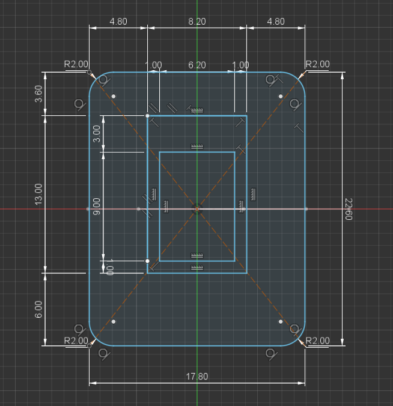

- SMD components protrude 2 mm. 
- The lens protrudes 3 mm from the circuit board. 

# Pin Assign
## 2.54mm Pitch Pin Header

SDIO / SCLK / NCS / MOTION / 3V3 / GND

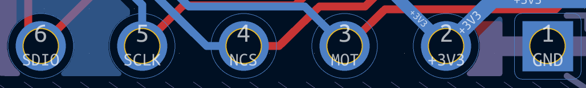

## 0.50mm Pitch FPC Connector

3V3 / MOTION / NCS / SCLK / SDIO / GND

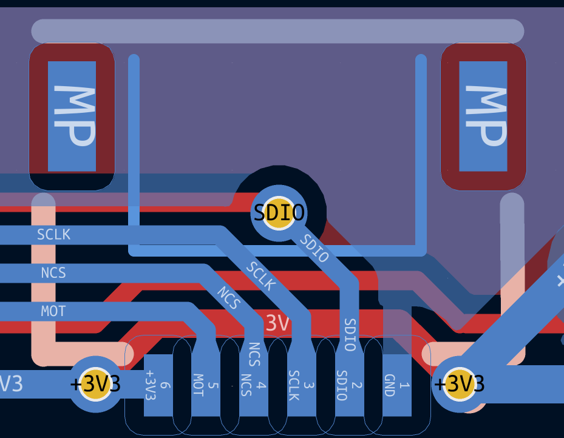

# Kicad PCB Preview
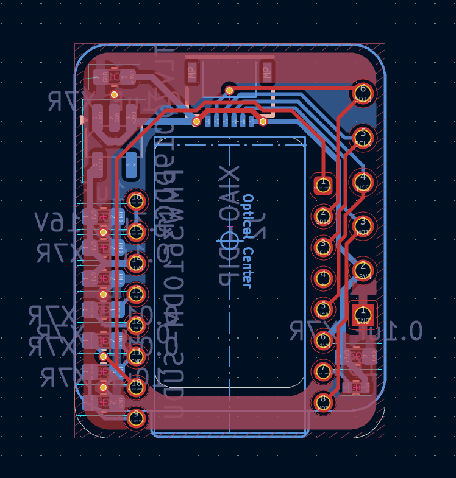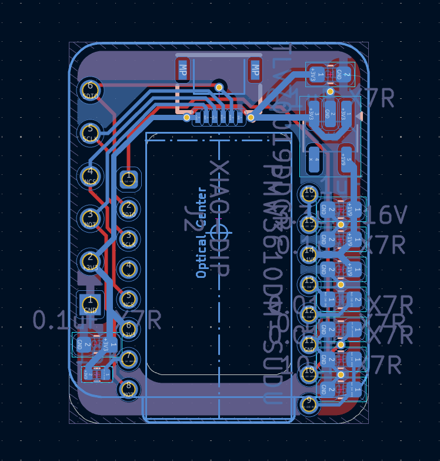

# Mounted the SMD components and sensors
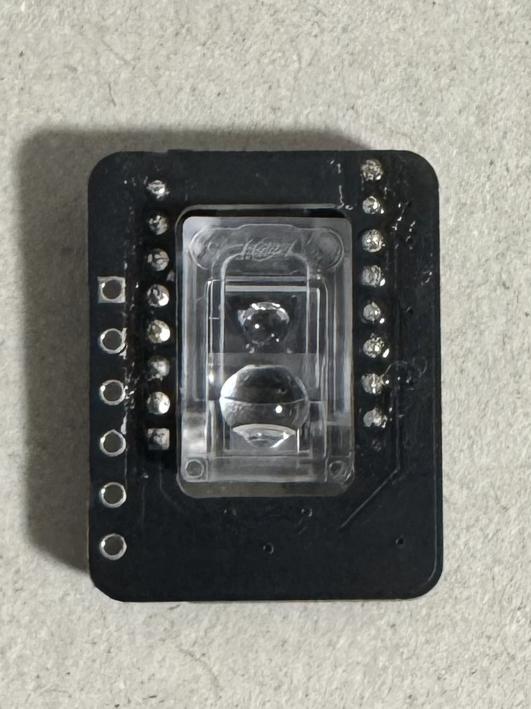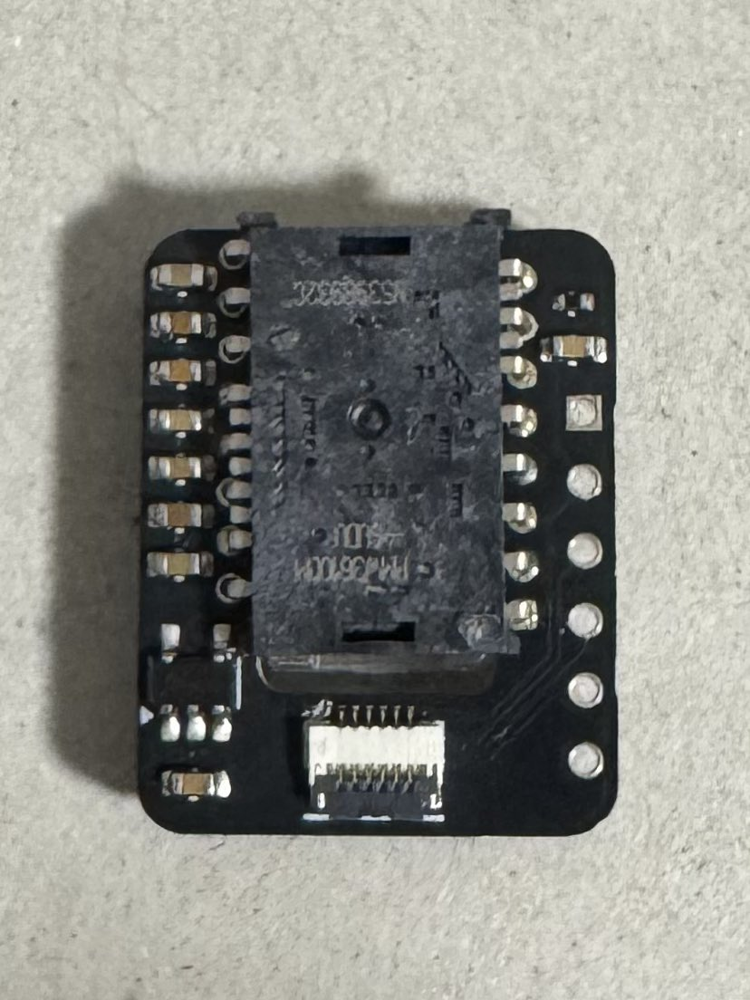

# With SeeedStudio XIAO (nRF52840-Plus)
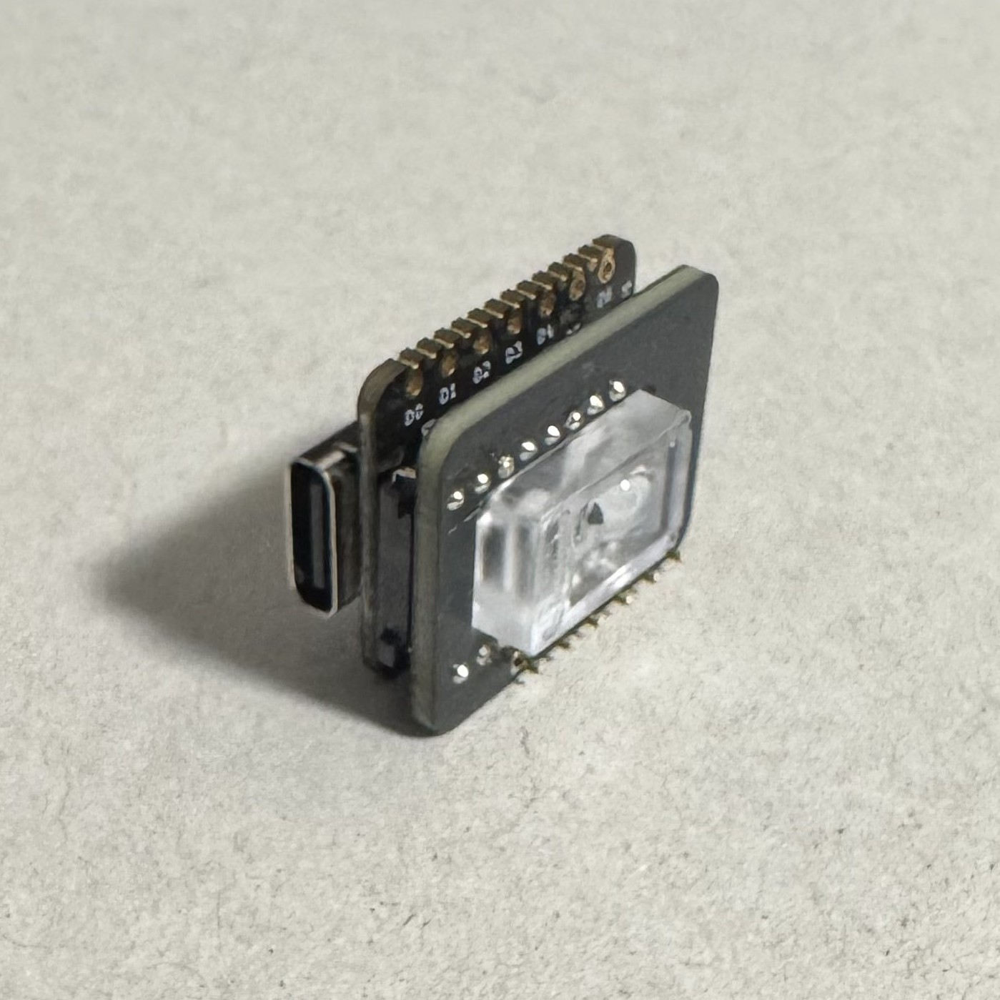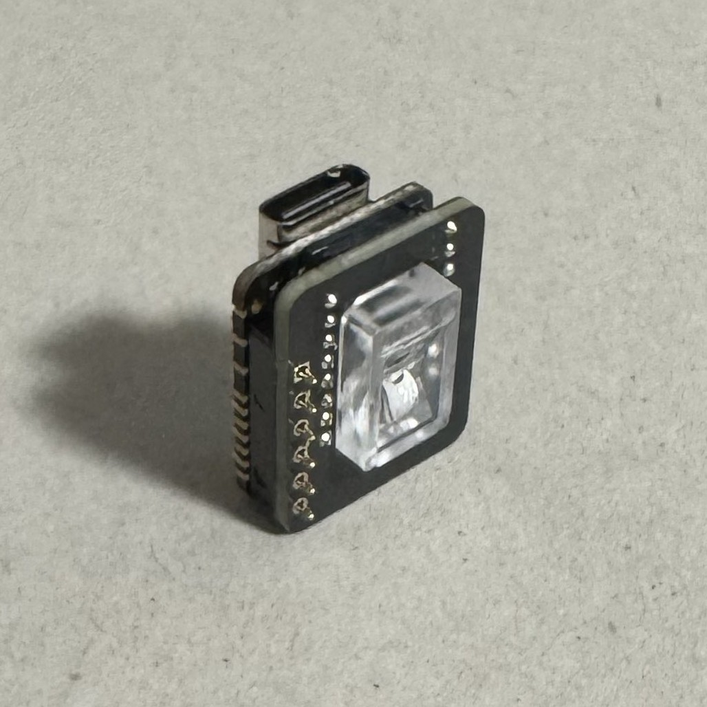
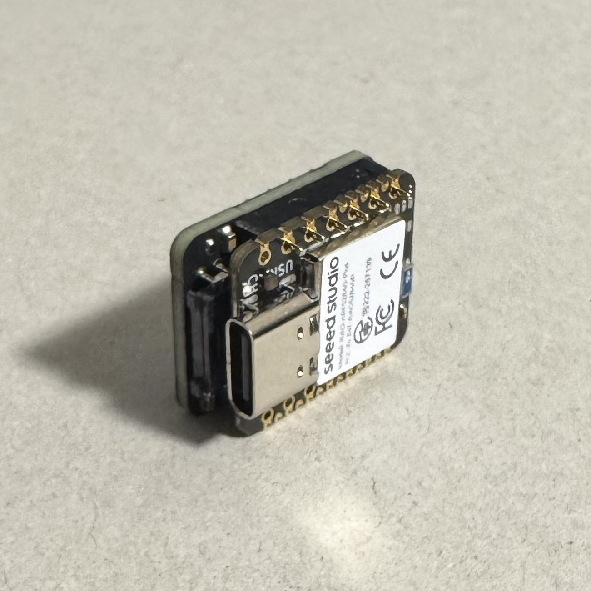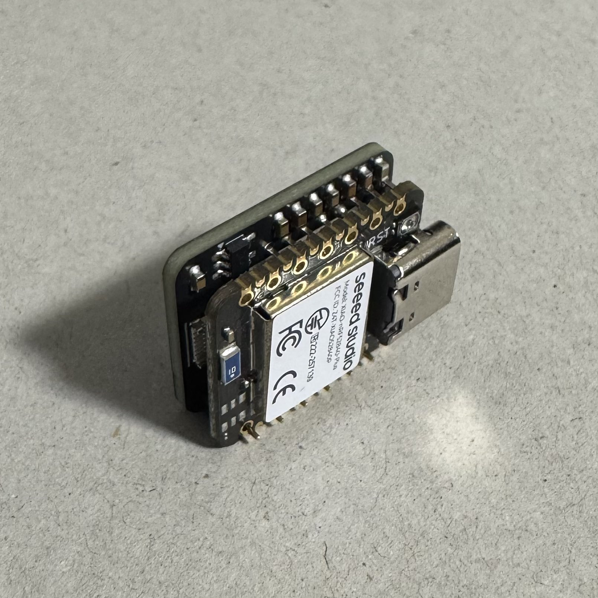

# STL Sample
<i>under preparation</i>

# ZMK Sample
https://github.com/skubmdi/zmk-config-pmw3610-xiao
